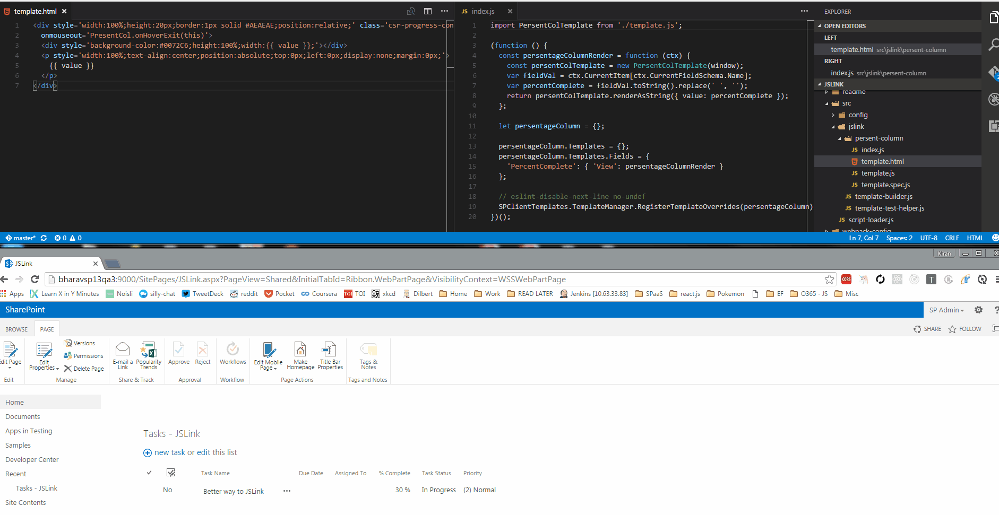
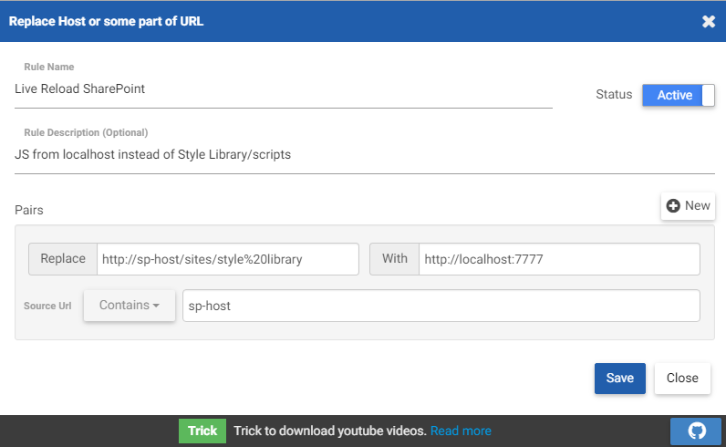

# SharePoint JSLink with Handlebars and LiveReload [](https://travis-ci.org/ravikiranvs/JSLinkLiveReload)

This source code does what is shown in the bellow snippet, but with Handlebars, Unit Testing (yes, even the html) and LiveReload.
``` JavaScript
(function () {
  var overrideCtx = {};
  overrideCtx.Templates = {};
  overrideCtx.Templates.Fields = {
    'PercentComplete': { 'View': renderPercentComplete }
  };
  SPClientTemplates.TemplateManager.RegisterTemplateOverrides(overrideCtx);
})();

function renderPercentComplete(ctx) {
 
    var fieldVal = ctx.CurrentItem[ctx.CurrentFieldSchema.Name];
    var percentComplete = fieldVal.toString().replace(" ", "");
    var mouseOver = 'this.childNodes[1].style.display="block";';
    var mouseOut = 'this.childNodes[1].style.display="none";';
 
    var html = '';
    html += "<div style='width:100%;height:20px;border:1px solid #AEAEAE;position:relative;'";
    html += "class='csr-progress-container'onmouseover='" + mouseOver + "'onmouseout='" + mouseOut + "'>";
    html += "<div style='background-color:#0072C6;height:100%;width:" + percentComplete + ";'></div>";
    html += "<p style='width:100%;text-align:center;position:absolute;top:0px;left:0px;display:none;margin:0px;'>";
    html += percentComplete;
    html += "</p>";
    html += "</div>";
 
    return html;
}
```

## Here is how it's going to work
[Fullscreen](https://raw.githubusercontent.com/ravikiranvs/JSLinkLiveReload/master/readme/livereload.gif)


# Liberaries and Tools
You may need a slight understanding of the below liberaries and tools: 
* [Handlebars](http://handlebarsjs.com/)
* [LiveReload](http://livereload.com/)
* [Babel](https://babeljs.io/)
* [webpack](https://webpack.github.io/)
* [ESLint](http://eslint.org/), [Karma](https://karma-runner.github.io), [Mocha](https://mochajs.org/), [Chai](http://chaijs.com/)

# JSLink Code
## The Handlebars Template
The Handlebars template is a `.html` file as seen in [template.html](src/jslink/persent-column/template.html)

The JavaScript functions used within the Handlebars template are namespaced like so: `onmouseover='PresentCol.onHover(this)'`

## Template Function Definitions
This is sort of like the code behind file for the Handlebars template. You have to create a `TemplateBuilder` class as done in [template.js](src/jslink/persent-column/template.js) 

The Handlebars template is imported into this file. See the [handlebars-loader](https://github.com/pcardune/handlebars-loader) to know how this works.

Apart from the `constructor` method you will need to create a method `getNamespacedTemplateEvents` where the namespaced events are defined.

## Using the template
The code for using the template builder class and calling the `SPClientTemplates.TemplateManager.RegisterTemplateOverrides` is [here](src/jslink/persent-column/index.js).

This is also the entry point for webpack. See [webpack's configuration](webpack-config).

### Important lines of code

``` JavaScript
const persentColTemplate = new PersentColTemplate(window);
```
This creates an object of the TemplateBuilder class and the namespaced functions are assigned to the DOM `window`.

``` JavaScript
return persentColTemplate.renderAsString({ value: percentComplete });
```
Here the HTML is generated from binding the template to the passed data and returned as a string.

# Unit Testing
The unit testing is run using Karma. It is configured to run in both IE and Chrome. See configuration file [here](karma-config/karma.conf.default.js).

> Running the unit tests: `npm run test`

## Test Helper
The [template-test-helper.js](src/jslink/template-test-helper.js) defines a function `renderTemplate` which takes a class inhereted from `TemplateBuilder` and data as its parameters and returns a jQuery object of the rendered html's first element.

## Writing Unit Tests
The unit test files can be placed anywhere within the `src` folder but have to end with the extention `.spec.js`

We have couple of testcases written for the persentage-column JSLink script [here](src/jslink/persent-column/template.spec.js).

Using the [template-test-helper.js](src/jslink/template-test-helper.js) we get the jQuery object of the persent-column template's root element.

The Asserts are done using the [chai-jquery](http://aaronsofaly.github.io/chai-docs/plugins/chai-jquery/) liberary.

# Build
> Generating the bundled and minified file for development: `npm run dev`

> Generating the bundled and minified file for production: `npm run build`

# Configuring the JSLink Webpart
This should be done using code but this is out of scope of this repo. You can follow manual steps for doing this:
1. Copy the `persent-column.bundle.js` present in `CDN\scripts` folder (after bulding ofcourse) to the SiteCollection's Style Liberary in a folder called `scripts`.
2. Create a Task List webpart and add the following to its JSLink property: `~sitecollection/Style Library/scripts/persent-column.bundle.js`

```
NOTE: use ~sitecollection if you are on a sub-site and ~site on the root site.
```

# Live Reload
> Continuously build and host files and start the LiveReload server: `npm start`

Injecting the LiveReload script tag on the SharePoint Page. Use this Chrome Extention - [LiveReload](https://chrome.google.com/webstore/detail/livereload/jnihajbhpnppcggbcgedagnkighmdlei)

Replacing the browser's requests for the script file from server with requests to localhost:7777. This is done using the Chrome Extention [Requestly](https://chrome.google.com/webstore/detail/requestly/mdnleldcmiljblolnjhpnblkcekpdkpa) with a rule like shown below.



If you wish to change the port number to something else, see the cnd script command in the [package.json](./package.json) file.

#### That's it! This should now enable livereloading.
